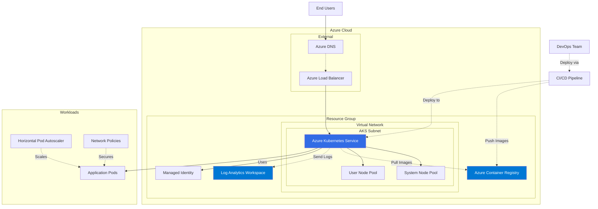
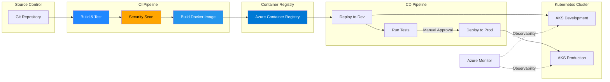
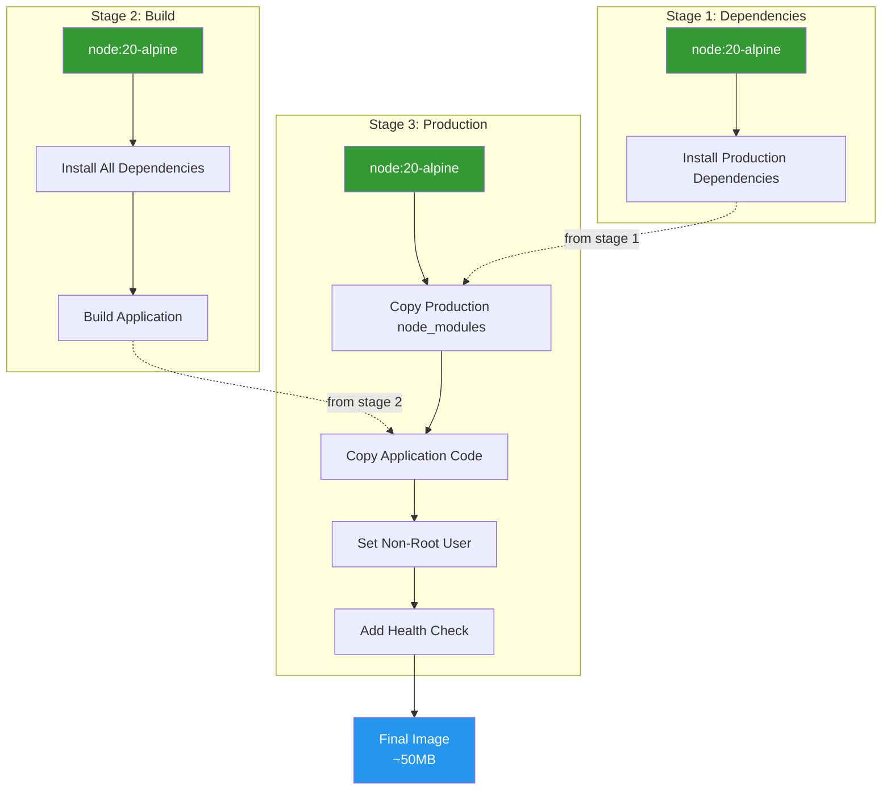
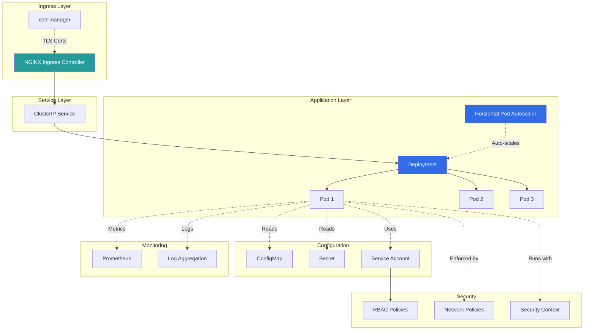

# Architecture Diagrams

This directory contains architecture diagrams and visual documentation for the DevOps examples.

## Azure AKS Architecture



## CI/CD Pipeline Flow



## Docker Multi-Stage Build



## Kubernetes Application Architecture



## Infrastructure as Code Workflow

```mermaid
graph LR
    subgraph "Development"
        CODE[Write Terraform Code]
        VALIDATE[Validate & Format]
        CODE --> VALIDATE
    end
    
    subgraph "CI Checks"
        LINT[Lint with tflint]
        SECURITY[Security Scan<br/>Checkov]
        PLAN[Terraform Plan]
        
        VALIDATE --> LINT
        LINT --> SECURITY
        SECURITY --> PLAN
    end
    
    subgraph "Review"
        PR[Pull Request]
        REVIEW[Code Review]
        APPROVAL[Approval]
        
        PLAN --> PR
        PR --> REVIEW
        REVIEW --> APPROVAL
    end
    
    subgraph "Deployment"
        MERGE[Merge to Main]
        APPLY[Terraform Apply]
        
        APPROVAL --> MERGE
        MERGE --> APPLY
    end
    
    subgraph "Azure Cloud"
        INFRA[Infrastructure Resources]
        STATE[Terraform State<br/>Azure Storage]
        
        APPLY --> INFRA
        APPLY -.->|Update| STATE
    end
    
    style CODE fill:#7B42BC,color:#fff
    style SECURITY fill:#FFA500,color:#000
    style APPLY fill:#7B42BC,color:#fff
    style INFRA fill:#0078D4,color:#fff
```



## Monitoring and Observability

```mermaid
graph TB
    subgraph "Application Layer"
        APP[Application Pods]
        METRICS_EP[/metrics Endpoint]
        LOGS_OUT[Log Output]
        
        APP --> METRICS_EP
        APP --> LOGS_OUT
    end
    
    subgraph "Collection Layer"
        PROM[Prometheus]
        FLUENTD[Fluentd/Fluent Bit]
        
        METRICS_EP -.->|Scrape| PROM
        LOGS_OUT -.->|Collect| FLUENTD
    end
    
    subgraph "Azure Monitor"
        LA[Log Analytics]
        AI[Application Insights]
        ALERTS[Azure Alerts]
        
        PROM -.->|Forward| LA
        FLUENTD --> LA
        APP -.->|Telemetry| AI
        LA -.->|Triggers| ALERTS
    end
    
    subgraph "Visualization"
        GRAFANA[Grafana Dashboards]
        PORTAL[Azure Portal]
        
        PROM --> GRAFANA
        LA --> PORTAL
    end
    
    subgraph "Notifications"
        EMAIL[Email]
        TEAMS[Microsoft Teams]
        SLACK[Slack]
        
        ALERTS --> EMAIL
        ALERTS --> TEAMS
        ALERTS --> SLACK
    end
    
    style PROM fill:#E6522C,color:#fff
    style LA fill:#0078D4,color:#fff
    style GRAFANA fill:#F46800,color:#fff
```

---

## Diagram Tools

These diagrams use Mermaid syntax and can be rendered in:
- GitHub Markdown
- Azure DevOps Wiki
- VS Code with Mermaid extension
- Mermaid Live Editor (https://mermaid.live)

## Usage

Copy the Mermaid code blocks into any Mermaid-compatible viewer to see the diagrams rendered.

## Contributing

When adding new diagrams:
1. Use consistent color schemes
2. Follow the existing style
3. Include a brief description
4. Test rendering in GitHub
